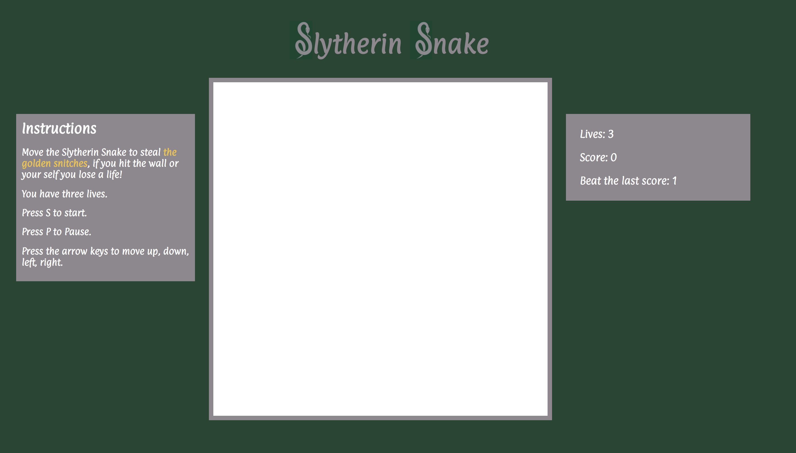
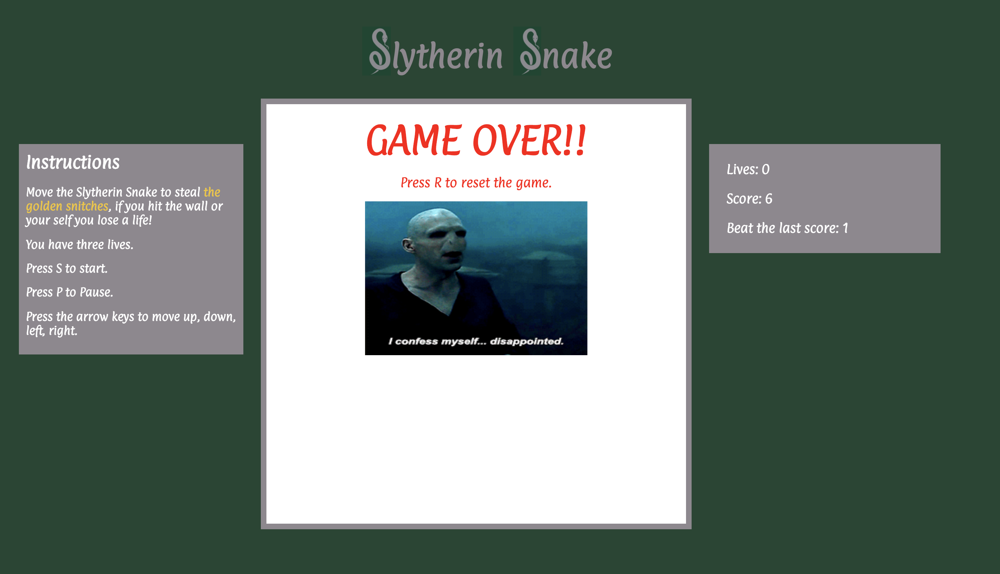

# Slytherin snake
## A Game Time Project (FE - Module 2)

Recreate the classic game Snake using Object Oriented Programming. 

### [Play here](https://tdberg21.github.io/game-time/ "play here")

## Goals

[X] Use OOP to drive the design of the game and the code

[X] Separate business-logic code from view-related code

[X] Create a robust test suite that thoroughly tests all functionality of a client-side application


## Playability Features

[X] Indicate when the game is over and won or lost

[X] Allow the user to start a new game

[X] Display a score (if applicable)

[X ] Include a clean UI surrounding the actual game interface itself (this might include instructions on how to play, a high score saved in localStorage, etc. Think of what would be most intuitive for your particular game.)


## Installing

Clone or download this repo then run 


```npm install```


and then run to start the server

```npm start```

## Testing 

To start testing run 

```npm test```

## Linting 

To the the eslint please use

```npm run eslint```

## Built with 

ES6

OOP style programming

HTML canvas

## Authors

[Tory Dannenberg](https://github.com/tdberg21 "His Github Homepage")

[Megan Kaiser](https://github.com/mrayanne113 "Her Github Homepage")

## License
This project is licensed under the MIT License 

### On page load






